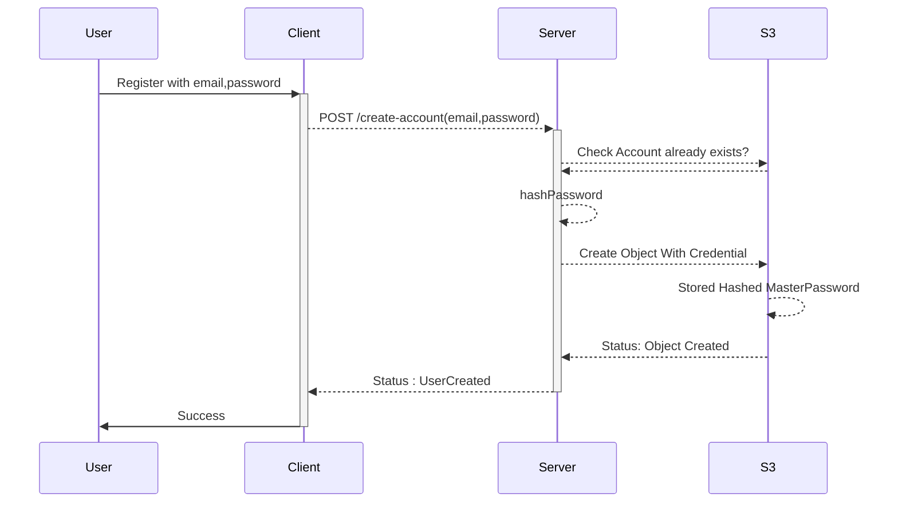
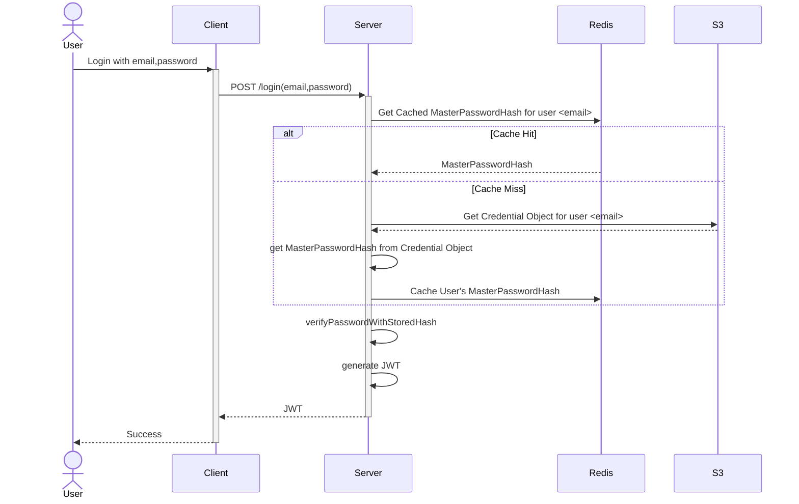
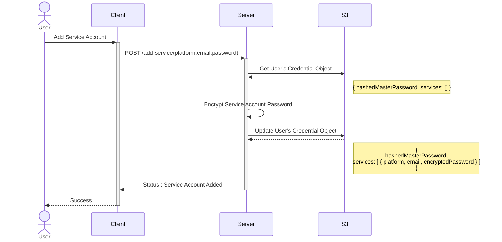

Register

```mermaid
sequenceDiagram
    User->>+Client: Register with email,password
    Client-->>+Server: POST /create-account(email,password)
    Server-->>S3: Check Account already exists?
    S3-->>Server: 
    Server-->>Server: hashPassword
    Server-->>S3: Create Object With Credential
    S3-->>S3: Stored Hashed MasterPassword
    S3-->>Server: Status: Object Created
    Server-->>-Client: Status : UserCreated
    Client->>-User: Success
```

Login

```mermaid
sequenceDiagram
    actor User
    User->>+Client: Login with email,password
    Client->>+Server: POST /login(email,password)
    Server->>Redis: Get Cached MasterPasswordHash for user <email>
    Alt Cache Hit
        Redis-->>Server: MasterPasswordHash
    else Cache Miss
        Server->>S3: Get Credential Object for user <email>
        S3-->>Server: 
        Server->>Server: get MasterPasswordHash from Credential Object
        Server->>Redis: Cache User's MasterPasswordHash
    end
    Server->>Server: verifyPasswordWithStoredHash
    Server->>Server: generate JWT
    Server-->>-Client: JWT
    Client-->>-User: Success
```

Add Account

```mermaid
sequenceDiagram
    actor User
    User->>+Client: Add Service Account
    Client->>+Server: POST /add-service(platform,email,password)
    Server->> S3: Get User's Credential Object
    S3-->> Server: 
    Note right of S3: { hashedMasterPassword, services: [] }
    Server->>Server: Encrypt Service Account Password
    Server->>S3: Update User's Credential Object
    S3-->>Server: 
    Note right of S3: { <br/>hashedMasterPassword, <br/>services: [ { platform, email, encryptedPassword } ] <br/>}
    Server-->>-Client: Status : Service Account Added
    Client-->>-User: Success
```